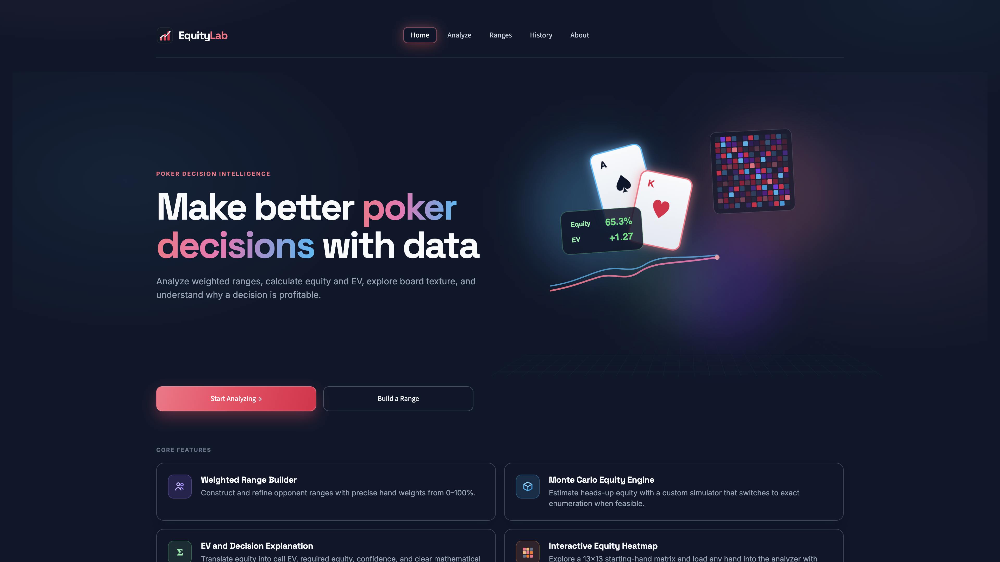

# EquityLab

EquityLab is a poker decision-analysis application for studying Texas Hold'em
situations. It combines a custom equity engine (exact enumeration and Monte Carlo
simulation) with weighted opponent ranges, expected-value and pot-odds analysis,
and deterministic decision explanations, all in an interactive Streamlit UI.



## Features

- **Weighted Range Builder** - construct opponent ranges from the 169 starting-hand
  classes with per-hand weights (0-100%), plus saved range presets.
- **Custom Equity Engine** - heads-up equity with two modes: full exact enumeration
  of every remaining matchup when the search space is small enough, and Monte Carlo
  simulation (10k-250k trials) with confidence intervals when it is not.
- **EV & Decision Analysis** - required equity (pot odds), call EV, and a
  deterministic recommendation with confidence bands (Marginal through Very
  Strong) derived from the equity margin, plus sensitivity text showing how much
  equity the decision can afford to lose.
- **Interactive Equity Heatmap** - a 13x13 matrix of equity for every starting
  hand against the current board and opponent range, cached for responsiveness.
- **Hand Breakdown** - board texture analysis, hero situation analysis (draws and
  outs), and the opponent's final hand-category distribution across simulated
  matchups.
- **Hand History** - persist analyses and named ranges to a local SQLite database
  and revisit them later.

## How It Works

1. You enter a hero hand, an optional board, and an opponent range (weighted or
   preset) on the **Analyze** page.
2. `poker_engine.py` parses the inputs, expands the weighted range into concrete
   matchups, and computes equity - exactly by enumerating every opponent hand and
   board runout when the matchup count fits the budget, or by Monte Carlo
   sampling otherwise.
3. `decision_analysis.py` turns equity into a decision: required equity from pot
   and call size, call EV, a recommendation, and a confidence label computed
   deterministically from the equity margin.
4. `equity_heatmap.py` reuses the same engine to price all 169 starting hands for
   the heatmap, keyed by board, range, and simulation settings.
5. `hand_history_store.py` saves each analysis and your named ranges to a local
   SQLite database (created on first run, not committed).

## Tech Stack

- **Python 3.12+** - application and equity engine (standard library only:
  `dataclasses`, `itertools`, `sqlite3`, `random`)
- **Streamlit** - multi-page UI (Home, Analyze, Ranges, History, About)
- **SQLite** - local persistence for hand history and saved ranges
- **unittest** - automated test suite

## Project Structure

```text
app.py                  Streamlit app: pages, UI, and wiring between modules
poker_engine.py         Cards, evaluator, range parsing, exact + Monte Carlo equity
decision_analysis.py    Pure EV / pot-odds / decision-explanation helpers
equity_heatmap.py       13x13 starting-hand equity heatmap with caching
hand_history_store.py   SQLite persistence for history and saved ranges
scripts/verify_home.py  Static + rendered checks for the Home page layout
tests/                  unittest suite for engine, EV math, heatmap, ranges, UI flow
assets/screenshots/     Screenshots used in this README
assets/                 App favicon
```

## Running Locally

```sh
git clone https://github.com/siddharth-iyer201/EquityLab.git
cd EquityLab
python3 -m pip install -r requirements.txt
python3 -m streamlit run app.py
```

Then open the local URL Streamlit prints, usually `http://localhost:8501`.
Python 3.12 or newer is required.

## Testing

```sh
python3 -m unittest discover -s tests
```

The suite covers the hand evaluator, exact and Monte Carlo equity, weighted
range expansion, board texture and hero-draw analysis, EV/decision
thresholds, the equity heatmap, and the analyze-page UI workflow.
